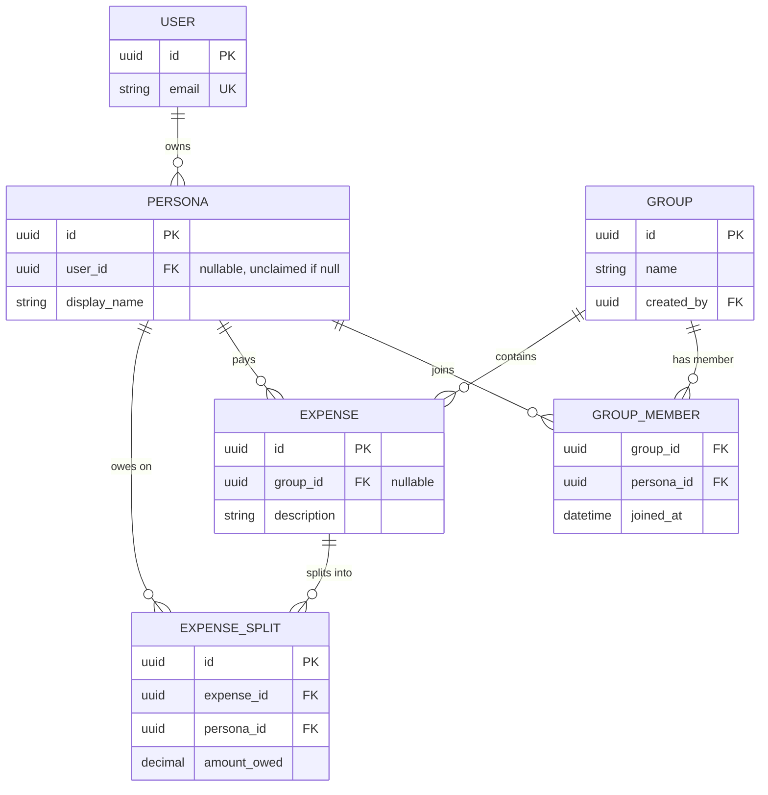

```mermaid
erDiagram
    USER ||--o{ PERSONA: "owns"
    PERSONA ||--o{ GROUP_MEMBER: "joins"
    GROUP ||--o{ GROUP_MEMBER: "has member"
    GROUP ||--o{ EXPENSE: "contains"
    PERSONA ||--o{ EXPENSE: "pays"
    EXPENSE ||--o{ EXPENSE_SPLIT: "splits into"
    PERSONA ||--o{ EXPENSE_SPLIT: "owes on"

    USER {
        uuid id PK
        string email UK
    }
    PERSONA {
        uuid id PK
        uuid user_id FK "nullable, unclaimed if null"
        string display_name
    }
    GROUP {
        uuid id PK
        string name
        uuid created_by FK
    }
    GROUP_MEMBER {
        uuid group_id FK
        uuid persona_id FK
        datetime joined_at
    }
    EXPENSE {
        uuid id PK
        uuid group_id FK "nullable"
        string description
    }
    EXPENSE_SPLIT {
        uuid id PK
        uuid expense_id FK
        uuid persona_id FK
        decimal amount_owed
    }
```
