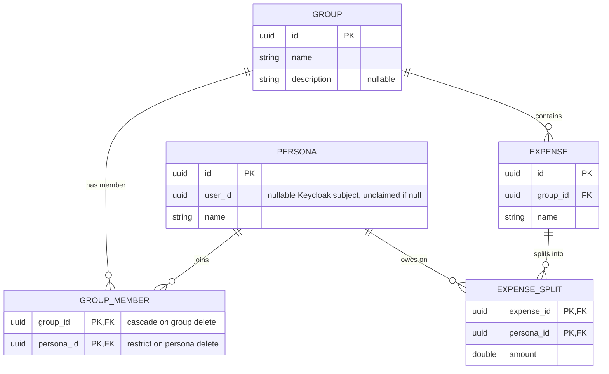

```mermaid
erDiagram
    PERSONA ||--o{ GROUP_MEMBER: "joins"
    GROUP ||--o{ GROUP_MEMBER: "has member"
    GROUP ||--o{ EXPENSE: "contains"
    EXPENSE ||--o{ EXPENSE_SPLIT: "splits into"
    PERSONA ||--o{ EXPENSE_SPLIT: "owes on"

    PERSONA {
        uuid id PK
        uuid user_id "nullable Keycloak subject, unclaimed if null"
        string name
    }
    GROUP {
        uuid id PK
        string name
        string description "nullable"
    }
    GROUP_MEMBER {
        uuid group_id PK,FK "cascade on group delete"
        uuid persona_id PK,FK "restrict on persona delete"
    }
    EXPENSE {
        uuid id PK
        uuid group_id FK
        string name
    }
    EXPENSE_SPLIT {
        uuid expense_id PK,FK
        uuid persona_id PK,FK
        double amount
    }
```

There is no users table; `user_id` is the Keycloak `sub`. GROUP, PERSONA and EXPENSE also carry `created_by`, `created_at`, `updated_by`, `updated_at`.
